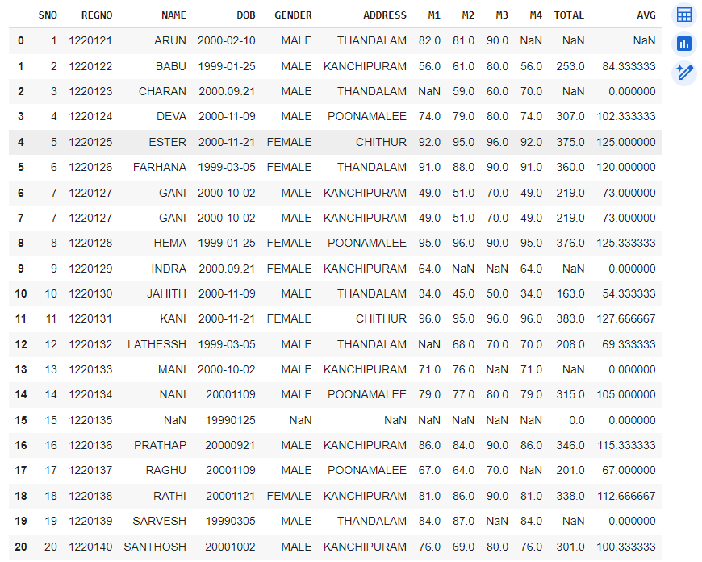
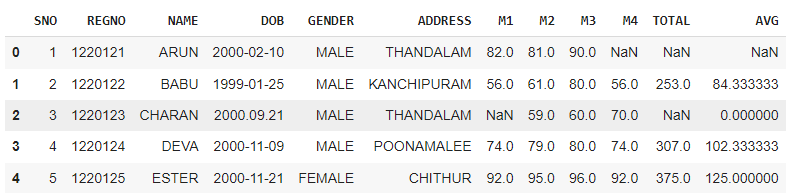
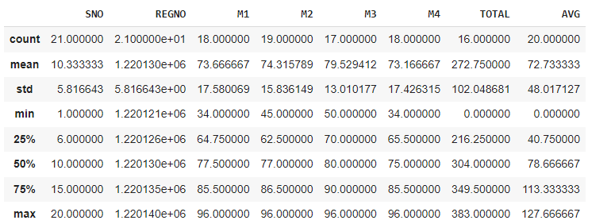
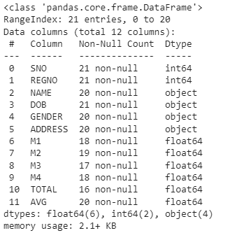
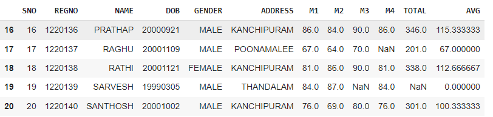
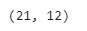
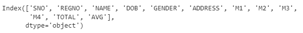
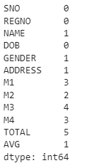
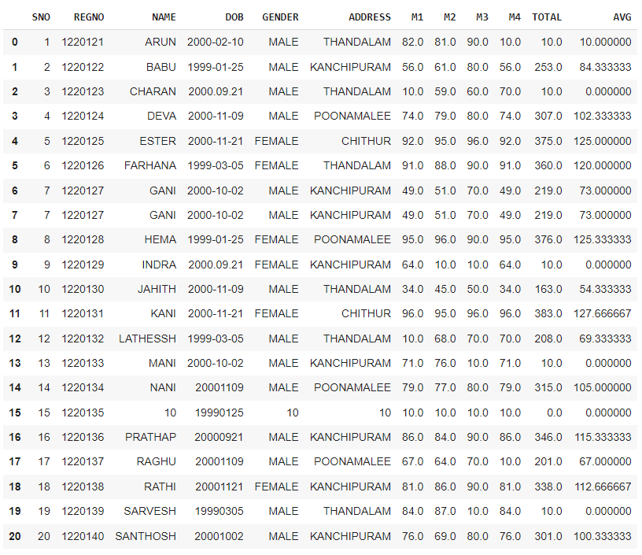

# Exno:1
Data Cleaning Process

# AIM
To read the given data and perform data cleaning and save the cleaned data to a file.

# Explanation
Data cleaning is the process of preparing data for analysis by removing or modifying data that is incorrect ,incompleted , irrelevant , duplicated or improperly formatted. Data cleaning is not simply about erasing data ,but rather finding a way to maximize datasets accuracy without necessarily deleting the information.

# Algorithm
STEP 1: Read the given Data

STEP 2: Get the information about the data

STEP 3: Remove the null values from the data

STEP 4: Save the Clean data to the file

STEP 5: Remove outliers using IQR

STEP 6: Use zscore of to remove outliers

# Coding and Output

Developed By: Sriram G

Register Number: 212222230149

```
import pandas as pd
df =pd.read_csv("SAMPLEIDS.csv")
print(df)
```

```
df.head(5)
```


```
df.describe()
```


```
df.info()
```


```
df.tail()
```


```
df.shape
```


```
df.columns
```

```
df.isnull().sum()
```

```
df.fillna(value=10)
```

```
df.fillna(method='ffill')
```


## IQR


## Z_Score


# Result
 
The Data Cleaning Process was executed successfully
